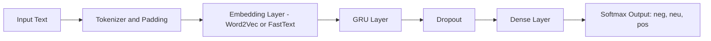

# Mermaid GRU Diagram

```mermaid
flowchart LR
  A[Input Text] --> B[Tokenizer and Padding]
  B --> C[Embedding Layer - Word2Vec or FastText]
  C --> D[GRU Layer]
  D --> E[Dropout]
  E --> F[Dense Layer]
  F --> G[Softmax Output: neg, neu, pos]
```
